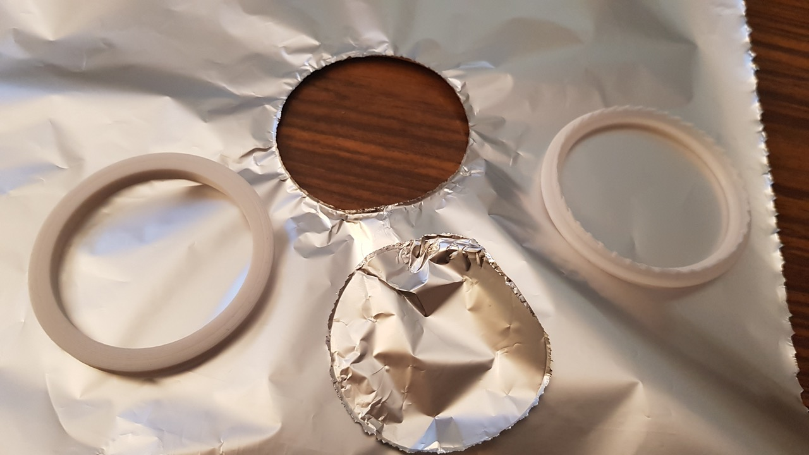

# Aluminium Foil Stove Cutter

by IOIO72 aka Tamio Patrick Honma (https://honma.de)

## Description

To protect your gas stove from dirt, you can use aluminum foil. Now you can cut out the circles for the burners with the aluminum foil gas stove cutter without any problems.

## Print

As the saws of the cutter are challenging to print, you need to adjust the setting in the slicer with caution. If you have trouble to print the saws, you can use the customizer and set the height of the saw tooth to zero and use the cutter without saws.

1. I recommend to use **0.1 layer heights** for the saws, to get accurate saw shapes.
2. Slow down the print **beginning with layer 44 when using 0.1 layer** and no adjustment to the cutter heights in the customizer. I **slowed it down to 20%**. In Cura you can use the ChangeAtZ plugin for this.
3. You may also **decrease the retraction feed rate and the retraction length** **for the saw layers**, because otherwise the extruder may squeeze the filament as it moves up and down in short times and jam the extrusion. Use the ChangeAtZ plugin in Cura as done above.

For the rest of the model you should avoid to use fill. **Use many walls** (i.e. 10) instead. This will increase the general speed of your print.

If you don't see the walls of the cutter, you should **enable thin walls** in your slicer.

## Customizer

As the gas stoves are different, you can use the customizer to use the diameters of your individual burners.

### Use OpenSCAD

1. **Download and install:** [OpenSCAD](http://openscad.org/) version 2021.01 or newer
2. **Download:** The *.scad file of this model.
3. **Start** OpenSCAD and **open** the *.scad file in it.
4. **Open the customizer** via the menu "Window/Customizer"

Now you can configure the model and use the `F5` key to render the preview of your changes.

#### Export your STL file

If you're done with your model settings, you can export the STL file:

1. Render the mesh by pressing the `F6` key.
2. Wait until the rendering is finished. This might take some minutes.
3. Export the STL file by pressing the `F7` key.

#### Optionally save your configuration

If you like to use your configuration as a template for further models, it's a good idea, to save your configuration:

1. Click the `+` symbol in the customizer, which you find beside the configuration selector drop-down in the second line of the customizer.
2. Give your configuration a name.

Use the drop-down menu to access your saved configurations.
